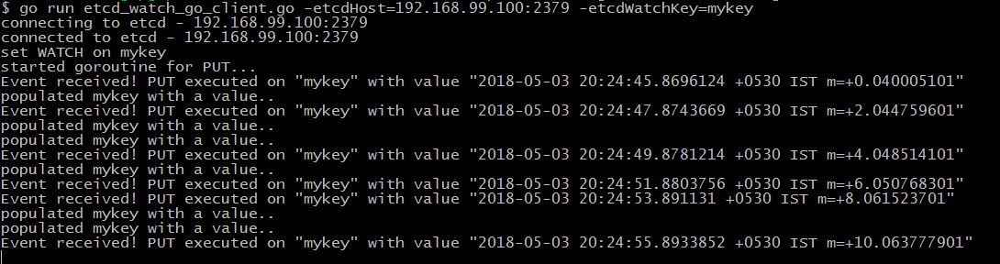

## etcd Watch example using Go client

- start etcd - `docker run --rm --name etcd -p 2379:2379 gcr.io/etcd-development/etcd /usr/local/bin/etcd --listen-client-urls http://0.0.0.0:2379 --advertise-client-urls http://192.168.99.100:2379`
- run client code - `go run etcd_watch_go_client.go -etcdHost=<etcd host>:<etcd port> -etcdWatchKey=<your key>`

e.g. `go run etcd_watch_go_client.go -etcdHost=192.168.99.100:2379 -etcdWatchKey=myKey`

- check logs

